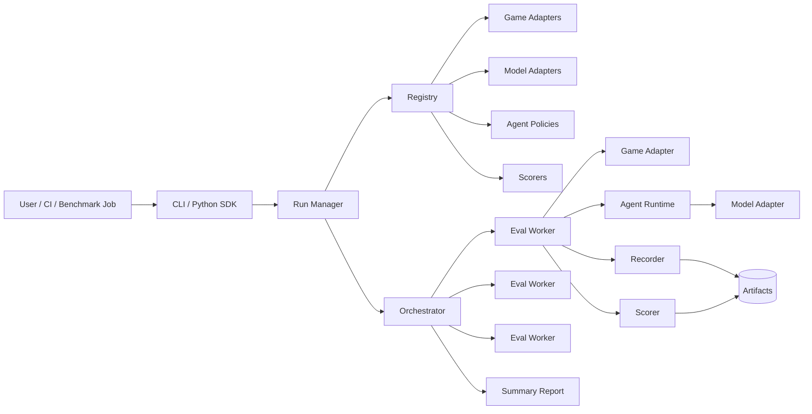
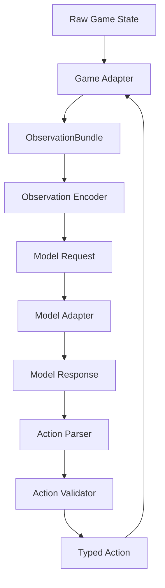
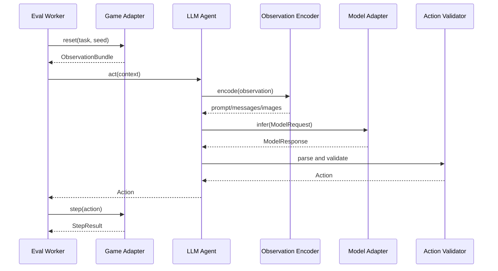
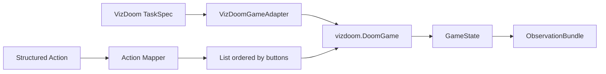
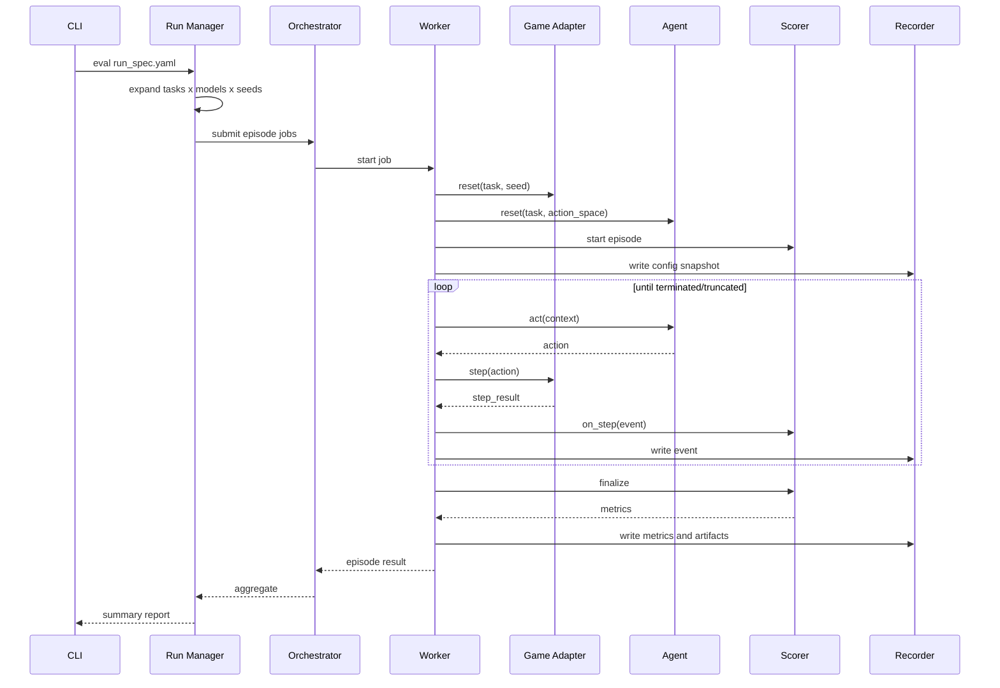
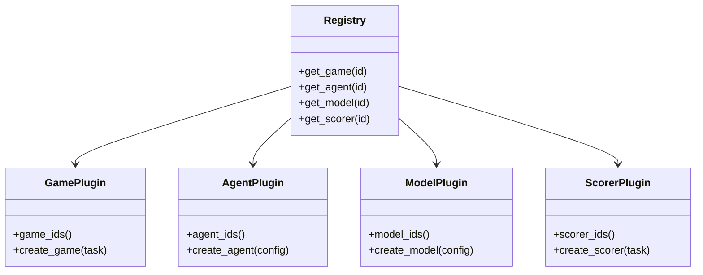

# Eval Kit 设计文档

本文档描述一个面向游戏环境的通用 eval kit。目标是让 LLM、VLM、RL policy、脚本 agent、本地模型、远程 API 模型都能以统一方式接入，同时让 ViZDoom 只是第一个游戏适配器，而不是框架本身的边界。

## 1. 目标

- 支持多种模型形态：LLM/VLM、强化学习 policy、传统 CV/规则 agent、远程 HTTP API、本地 Python 模型、子进程或容器内模型。
- 支持多种游戏环境：实时 FPS、回合制游戏、文本游戏、浏览器游戏、模拟器环境。
- 每次 eval 可复现：固定版本、固定 seed、固定任务配置、完整事件日志、可选视频和 replay。
- 核心框架只定义抽象和运行协议，具体游戏、模型、评分逻辑通过 adapter/plugin 扩展。
- 对 LLM 友好：提供观测编码、prompt、动作 JSON schema、动作校验和修复链路。
- 对高吞吐评测友好：支持本地并行、后续可扩展到容器/集群/远程 worker。

## 2. 非目标

- 不做训练框架。eval kit 可以加载训练好的 policy，但不负责训练 loop。
- 不强制所有游戏实现 Gymnasium API。可以兼容 Gymnasium，但内部使用更通用的 adapter contract。
- 不把游戏 reward 等同于最终评分。reward 可以是原始信号，最终 score 应由 scorer 明确计算。
- 初期不做完整 leaderboard 网站。先保证 CLI、artifact、JSONL、汇总报告稳定。

## 3. 总体架构



核心思想：

- `Run Manager` 读取 run spec，展开 game/task/model/seed 的笛卡尔组合。
- `Orchestrator` 负责调度 worker，可以先做本地多进程，后续接远程 worker。
- `Eval Worker` 执行单个 episode 或一组 episode。
- `Game Adapter` 只负责游戏生命周期和 step。
- `Agent Runtime` 把游戏观测转成模型输入，再把模型输出转成游戏动作。
- `Model Adapter` 屏蔽 OpenAI-compatible API、本地 HF 模型、RL policy、子进程等差异。
- `Scorer` 从事件流、游戏状态、任务定义里计算最终指标。
- `Recorder` 统一写事件、metrics、视频、replay、配置快照。

## 4. 核心抽象

| 抽象 | 职责 | 例子 |
| --- | --- | --- |
| `TaskSpec` | 定义一次任务：游戏、地图、目标、seed、时间限制、观测 profile、评分规则 | `vizdoom.basic.survive_300` |
| `GameAdapter` | 封装游戏 reset/step/close，暴露观测和动作空间 | `VizDoomGameAdapter` |
| `ObservationBundle` | 统一表示图像、文本、结构化状态、音频、事件 | screen RGB、health、ammo、labels |
| `ActionSpace` | 描述动作 schema，并负责 validate/clip/serialize | binary buttons、mouse delta、JSON command |
| `AgentPolicy` | 决策层。可以是 LLM agent、RL agent、规则 agent | `JsonLLMAgent` |
| `ModelAdapter` | 模型调用层。可以同步/异步、远程/本地 | OpenAI API、vLLM、PyTorch module |
| `Scorer` | 计算 episode 级和 benchmark 级指标 | reward sum、kills、success rate |
| `Recorder` | 持久化事件、动作、观测摘要、视频、replay、metrics | `events.jsonl`、`metrics.json` |

建议不要让模型直接依赖游戏对象。模型只看 `AgentContext`，输出 action payload。游戏细节通过 adapter 和 action schema 隔离。

## 5. 接口草案

```python
from dataclasses import dataclass
from typing import Any, Protocol


@dataclass(frozen=True)
class StepResult:
    observation: "ObservationBundle"
    reward: float
    terminated: bool
    truncated: bool
    info: dict[str, Any]


class GameAdapter(Protocol):
    game_id: str

    def action_space(self) -> "ActionSpace": ...

    def observation_spec(self) -> "ObservationSpec": ...

    def reset(self, task: "TaskSpec", seed: int) -> StepResult: ...

    def step(self, action: "Action") -> StepResult: ...

    def render_frame(self) -> bytes | None: ...

    def close(self) -> None: ...


class AgentPolicy(Protocol):
    agent_id: str

    def reset(self, task: "TaskSpec", action_space: "ActionSpace") -> None: ...

    def act(self, context: "AgentContext") -> "Action": ...


class ModelAdapter(Protocol):
    model_id: str

    def infer(self, request: "ModelRequest") -> "ModelResponse": ...


class Scorer(Protocol):
    scorer_id: str

    def on_step(self, event: "StepEvent") -> None: ...

    def finalize(self) -> dict[str, float | int | str]: ...
```

接口需要保持窄而稳定。像 ViZDoom 的 `DoomGame`、Gymnasium env、浏览器页面、Unity 进程，都可以在 `GameAdapter` 内部处理，不泄漏给 agent。

## 6. 观测与动作模型



`ObservationBundle` 建议支持：

- `frames`: 一张或多张 RGB/gray/depth/label 图。
- `variables`: 结构化数值，比如 health、ammo、position、angle。
- `events`: 最近的环境事件，比如 pickup、hit、death、message。
- `text`: 游戏内文字、任务说明、可见 UI 文本。
- `audio`: 可选音频片段或音频特征。
- `metadata`: tick、episode time、seed、map、remaining time。

`ActionSpace` 建议支持组合动作：

- `Discrete`: 离散动作 ID。
- `MultiBinary`: 多个二值按钮。
- `ContinuousBox`: 连续控制，比如 mouse delta、joystick axis。
- `StructuredJson`: LLM 友好的 JSON 动作。
- `TextCommand`: 文本游戏或 shell-like 游戏命令。

对实时游戏，动作还需要定义 `hold_ticks` 或 `frame_skip`。模型不需要每个游戏 tick 都推理一次，可以每 N tick 决策一次，中间由 adapter 复用上一个动作或执行 no-op。

## 7. LLM/VLM 接入设计

LLM agent 不应该直接输出 ViZDoom 的底层 list，例如 `[1, 0, 5, -2, 0]`。更稳的方式是输出有 schema 的 JSON，再映射到底层动作。

```json
{
  "move_forward": true,
  "strafe_delta": 0.0,
  "turn_delta": 5.0,
  "look_delta": -2.0,
  "attack": false
}
```

LLM agent 由四个组件组成：

- `ObservationEncoder`: 把 screen、labels、game variables 编成图片、多模态消息或文本摘要。
- `PromptBuilder`: 合成系统提示、任务目标、动作 schema、历史短记忆。
- `ActionParser`: 从模型输出解析 JSON，拒绝自由文本动作。
- `ActionValidator`: 根据 action schema clip 数值、补默认值、记录 parse error。



为了比较不同 LLM，必须记录：

- model name、provider、temperature、max tokens、seed 或 deterministic 参数。
- prompt 模板版本。
- observation encoder 版本。
- action parse 失败次数、repair 次数、超时次数。
- 每一步 token usage 和 latency。

## 8. ViZDoom 作为第一个 Game Adapter

ViZDoom adapter 负责把 `vizdoom.DoomGame` 包进通用协议。



建议的 ViZDoom 配置层：

```yaml
id: vizdoom.basic_mouse_v1
game: vizdoom
scenario:
  config_file: basic.cfg
  map: map01
  frame_skip: 4
  episode_timeout: 300
  visible: false
observations:
  screen: true
  game_variables:
    - HEALTH
    - AMMO2
    - ANGLE
    - PITCH
actions:
  schema: vizdoom_mouse_json_v1
  buttons:
    - MOVE_FORWARD
    - MOVE_LEFT_RIGHT_DELTA
    - TURN_LEFT_RIGHT_DELTA
    - LOOK_UP_DOWN_DELTA
    - ATTACK
  limits:
    MOVE_LEFT_RIGHT_DELTA: 10
    TURN_LEFT_RIGHT_DELTA: 10
    LOOK_UP_DOWN_DELTA: 5
scoring:
  scorer: vizdoom_default_v1
  metrics:
    - total_reward
    - survival_ticks
    - ammo_used
```

底层 ViZDoom 动作 list 的顺序必须严格等于 `buttons` 顺序。adapter 应保存这个顺序，并只暴露稳定 JSON schema 给 agent。

示例映射：

| JSON 字段 | ViZDoom button | 类型 |
| --- | --- | --- |
| `move_forward` | `MOVE_FORWARD` | bool |
| `strafe_delta` | `MOVE_LEFT_RIGHT_DELTA` | float |
| `turn_delta` | `TURN_LEFT_RIGHT_DELTA` | float |
| `look_delta` | `LOOK_UP_DOWN_DELTA` | float |
| `attack` | `ATTACK` | bool |

## 9. Eval 生命周期



## 10. 数据与 artifacts

每次 run 建议生成一个不可变目录：

```text
runs/
  2026-06-19T09-30-00Z_vizdoom_eval/
    run_spec.yaml
    resolved_spec.yaml
    env.json
    summary.json
    episodes/
      task=vizdoom.basic_mouse_v1/model=gpt-x/seed=1/
        config_snapshot.yaml
        events.jsonl
        actions.jsonl
        metrics.json
        video.mp4
        replay.lmp
        stderr.log
```

`events.jsonl` 建议每行记录：

```json
{
  "episode_id": "task=vizdoom.basic_mouse_v1/model=model_a/seed=1",
  "step": 12,
  "tick": 48,
  "action": {"turn_delta": 5.0, "attack": false},
  "reward": -4.0,
  "terminated": false,
  "truncated": false,
  "observation_refs": {"screen": "frames/000012.jpg"},
  "info": {"health": 100, "ammo": 46},
  "latency_ms": 812,
  "parse_error": false
}
```

`metrics.json` 建议只放 episode 级结果：

```json
{
  "total_reward": -123.0,
  "survival_ticks": 300,
  "success": false,
  "action_parse_failures": 0,
  "mean_step_latency_ms": 650.2
}
```

## 11. Run spec

用户入口应该是一个 declarative run spec：

```yaml
id: smoke_vizdoom_models
defaults:
  repeats: 1
  seeds: [1, 2, 3]
  max_parallel_workers: 4

tasks:
  - vizdoom.basic_mouse_v1
  - vizdoom.deadly_corridor_v1

agents:
  - id: random_mouse_agent
    type: builtin.random
  - id: llm_json_agent
    type: llm.json_policy
    model: openai_compatible.gpt_x
    prompt_template: vizdoom_fps_v1
    observation_encoder: image_plus_state_v1

models:
  - id: openai_compatible.gpt_x
    type: openai_compatible_chat
    endpoint: ${OPENAI_COMPATIBLE_BASE_URL}
    model: gpt-x
    temperature: 0

recording:
  events: true
  frames: every_step
  video: true
```

Run Manager 展开后，每个 episode 都应该有独立的 resolved spec，避免运行后外部配置变化导致不可复现。

## 12. Plugin 与 registry



初期可以用 Python entry points 或显式 YAML registry。建议同时支持：

- 内置插件：`evalkit.games.vizdoom`、`evalkit.agents.random`。
- 本地插件目录：便于快速开发新游戏。
- 第三方包 entry point：便于团队共享。

建议目录结构：

```text
evalkit/
  core/
    adapters.py
    action_space.py
    observation.py
    runner.py
    recorder.py
    registry.py
    task_spec.py
  agents/
    random_agent.py
    llm_json_agent.py
  models/
    openai_compatible.py
    local_python.py
    subprocess_model.py
  games/
    vizdoom/
      adapter.py
      action_schemas.py
      tasks/
  scorers/
    common.py
    vizdoom.py
  cli.py
```

## 13. 新游戏接入流程

接入新游戏只需要实现四件事：

1. `GameAdapter`: reset、step、close、render。
2. `ObservationSpec`: 游戏能给 agent 什么信息。
3. `ActionSpace`: agent 能做什么动作，如何 validate。
4. `Scorer`: 什么叫成功，核心指标如何算。

不同游戏可以有不同执行模型：

| 游戏类型 | Step 设计 | 动作类型 |
| --- | --- | --- |
| 实时 FPS | 每 N tick 决策一次 | keyboard、mouse delta、continuous |
| 回合制棋类 | 每回合一步 | legal move discrete/string |
| 文本游戏 | 每条命令一步 | text command |
| 浏览器游戏 | DOM/screenshot 驱动 | click、type、scroll |
| 模拟器游戏 | frame skip | controller buttons、analog stick |

核心框架不需要知道这些差异。它只处理 `ObservationBundle -> AgentPolicy -> Action -> GameAdapter.step()`。

## 14. 评分设计

评分分三层：

- `Raw Signals`: 游戏原始 reward、health、ammo、position、tick。
- `Episode Metrics`: 单局结果，例如 success、survival_ticks、kills、total_reward。
- `Benchmark Metrics`: 多 seed 多任务聚合，例如 average_score、success_rate、confidence interval。

不要把 LLM 的 action parse failure 静默吞掉。它应该进入 metrics，因为这反映模型是否真的能接入环境。

建议通用 metrics：

- `success_rate`
- `mean_score`
- `median_score`
- `mean_episode_length`
- `mean_latency_ms`
- `timeout_rate`
- `invalid_action_rate`
- `parse_failure_rate`
- `cost_usd` 或 token usage

## 15. 并行与隔离

初期推荐本地多进程：

- 一个 worker 一个游戏实例，避免环境状态互相污染。
- 每个 episode 设置 wall-clock timeout。
- 模型 API 调用设置 request timeout 和 retry policy。
- 每个 worker 写自己的临时 artifact，结束后由 Run Manager 汇总。

后续可扩展：

- 容器 worker：隔离系统依赖和 GPU。
- 远程 worker：适合长 benchmark。
- Model server pool：多个 worker 共用 vLLM/TGI/OpenAI-compatible endpoint。

## 16. 可复现性与安全边界

必须记录：

- eval kit 版本、plugin 版本、Python 版本、OS、GPU/CPU 信息。
- 代码版本，优先记录 `jj` change id 和 git commit hash。
- package lock，比如 `uv.lock`。
- task spec、resolved model config、prompt template hash。
- game engine 版本和 scenario 文件 hash。
- seed 列表。

动作安全：

- 所有动作先过 `ActionSpace.validate()`。
- 连续动作必须 clip 到任务定义范围。
- LLM 输出必须 parse 成 JSON，失败时记录并执行 fallback action。
- 子进程/容器模型要限制工作目录、网络、超时和输出大小。

## 17. 推荐里程碑

### M1: 单机最小可用

- Core contracts。
- CLI: `evalkit run run_spec.yaml`。
- `VizDoomGameAdapter`。
- `RandomAgent` 和 `ScriptedAgent`。
- `LLMJsonAgent`，先支持 OpenAI-compatible chat/multimodal API。
- `events.jsonl`、`metrics.json`、summary report。

### M2: 稳定 benchmark

- 多 seed、多模型、多任务并行。
- 视频/replay 录制。
- 任务 registry。
- prompt/action schema 版本化。
- 基础 HTML 或 Markdown report。

### M3: 多游戏和远程执行

- 第二个游戏 adapter，验证抽象是否足够通用。
- 容器 worker。
- 远程 model server pool。
- 更完整的 artifact viewer。

## 18. 关键设计取舍

- 内部协议不直接采用 Gymnasium，但可以提供 Gymnasium bridge。原因是 LLM/浏览器/文本游戏需要更丰富的观测和结构化动作。
- Agent 和 Model 分层。原因是同一个模型可以被不同 prompt/action parser 组合成不同 agent。
- Action 先结构化，再映射到底层游戏动作。原因是底层动作 list 容易随游戏和按钮顺序变化，直接暴露给 LLM 不稳定。
- Scorer 独立于 Game Adapter。原因是同一个游戏可有多个任务和评分规则。
- Artifact 优先使用 JSONL。原因是便于 streaming、调试、失败恢复和后续分析。

## 19. 待确认问题

- LLM 是否主要走视觉输入，还是先用游戏 labels/object info 生成文本摘要。
- 评测更关心“真实屏幕像素能力”，还是允许结构化 game variables。
- 是否需要实时观看 human rendering，还是只要离线视频。
- 模型接入是否需要从第一版就支持容器，还是先支持 Python/HTTP。
- ViZDoom 任务是否以官方 cfg 为主，还是需要自定义 WAD/ACS 奖励脚本。
